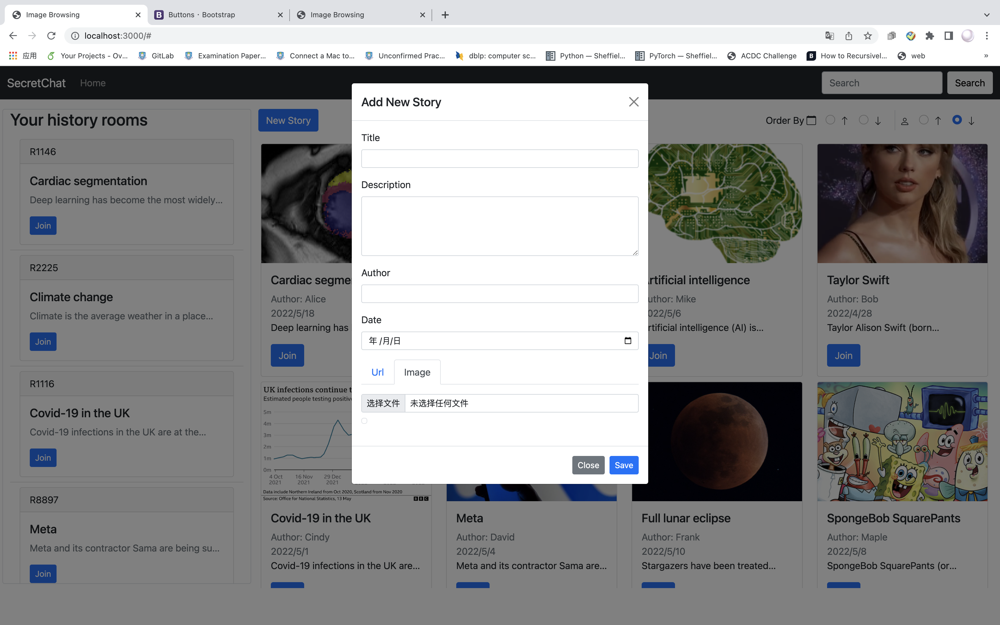
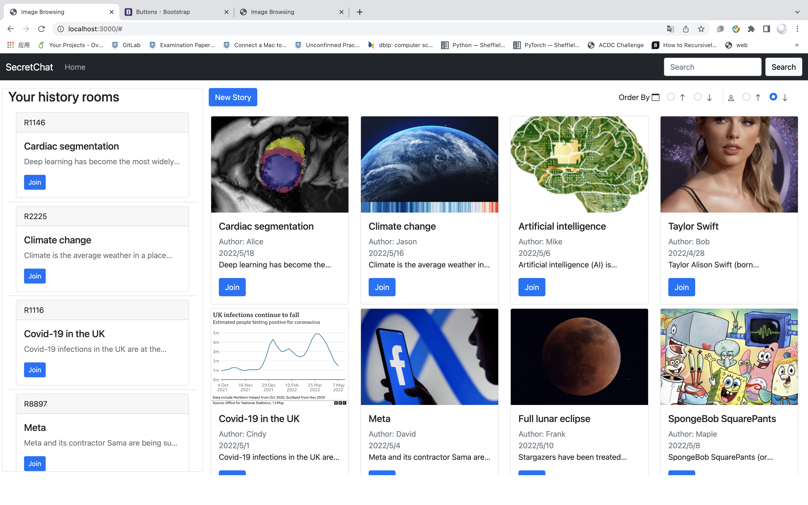
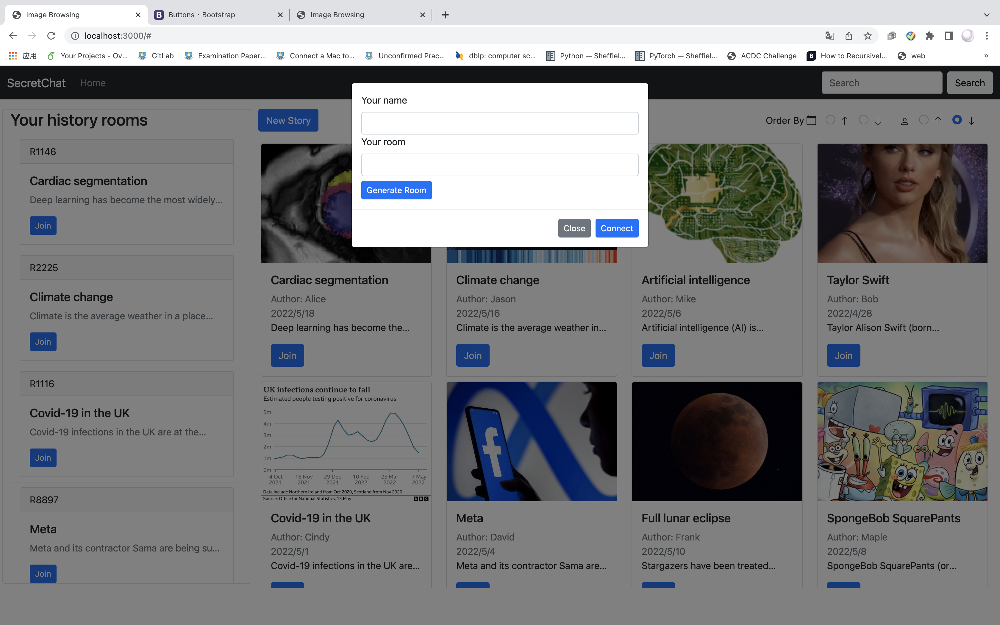
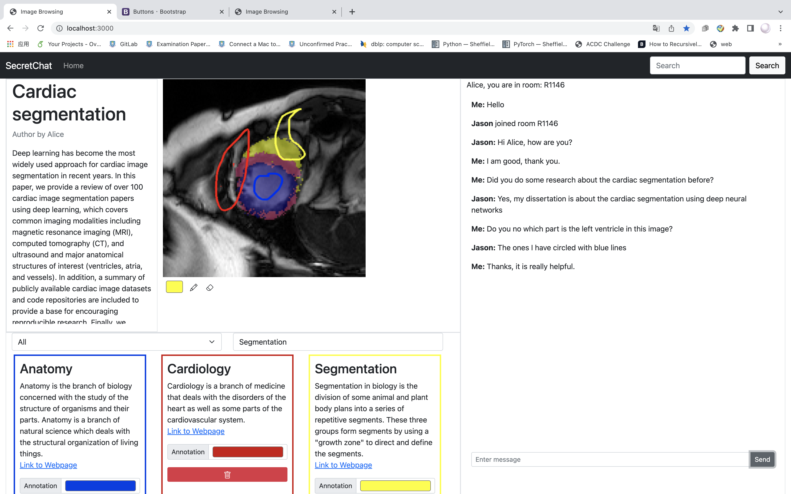

# COM3504 The Intelligent Web

## Setup

1. Navigate to the project directory.
2. Run `npm install` in the terminal to install the required libraries.
3. Make sure the MongoDB is running on port 27017.
4. Run `npm start` to start up the server.
5. Browse http://localhost:3000/

## How to use

It is a system used to help a unit of secret agents that can be used to share relevant information about a specific mission and its context. The site allows users to anonymously upload stories (pictures and their descriptions) and create rooms based on them. Except for uploading photographs, all discussion and annotation history will be maintained locally in this system, and the server will not record any of the data. Users may also utilise the system without an internet connection to access the history.

## New story

1. Click the **Home button** on the Navbar. 

2. Click the **New Story button** to write a new story.

3. Fill in the information (title, description, author, date).

4. Insert the image by adding a URL or loading from a local computer.

5. Click the **Save button** to save the story.

   

​																			Figure1. Add new story

## View, search and sort stories

1. Open the Home page.

2. All pictures’ thumbnail view will be presented as a single story.

3. Input the Story title in the **search box** at the top right corner.

4. All stories can be ordered by **author name** or **date of creation**.

5. After clicking the **search button**, the results will appear in the Home page.

   

																			Figure2. Home page

## Join a chat room

1. Click the **Join button** on the story card.
2. Fill in your **name** and the room number or click the **Generate Room button** to randomly generate the room number.
3. Click the **Connect button** to redirect to the chat page.

                                                                        

​                                                                          Figure3. Join room

## View history chat rooms

1. Your history chat rooms are located on the left side of the Home page.
2. Room number, story title, and decription will be shown in the history room card.
3. Click the **Join button** to join your history room.

## Chat Room

1. Click the **Join button** under the story you want to join with.

2. Then you can type in the **text box** in the right half of the page.

3. Click the **Send button**.

4. Start a chating journey.

   

​                                                                           Figure4. Chat room

## Drawing and clearing the annotation

1. Click the **pen icon** at the bottom of the drawing dialog.
2. Draw key information that you want to highlight.
3. You can choose a different colour of the pen to draw the line.
4. Click the **eraser icon** to clean the line you don’t want to appear with on the picture.

## Tag drawing annotation with Knowledge Graph

1. Select the type in the bottom left hand corner and search for relevant information.
2. Customise the colour of the knowledge graph and then you can annotate the image.
3. The knowledge graph can be saved locally and you can click the **Delete button** to delete the selected knowledge graph.

## Share room

1. Sharing the room by giving the room number to your friend.
2. Inserting the room number to the corresponding story card by clicking the **Join button**. 

## Contact

1. Team: PowerPuff Girls

2. Team members: 

   Ruiqing Xu ([rxu22@sheffield.ac.uk](mailto:rxu22@sheffield.ac.uk))              

   Feng Li ([fli31@sheffield.ac.uk](mailto:fli31@sheffield.ac.uk))              

   Hanmin Jia ([hjia5@sheffield.ac.uk](mailto:hjia5@sheffield.ac.uk))   

3. Github repo url: https://github.com/fluffyalice/COM3504_Intelligent_Web 